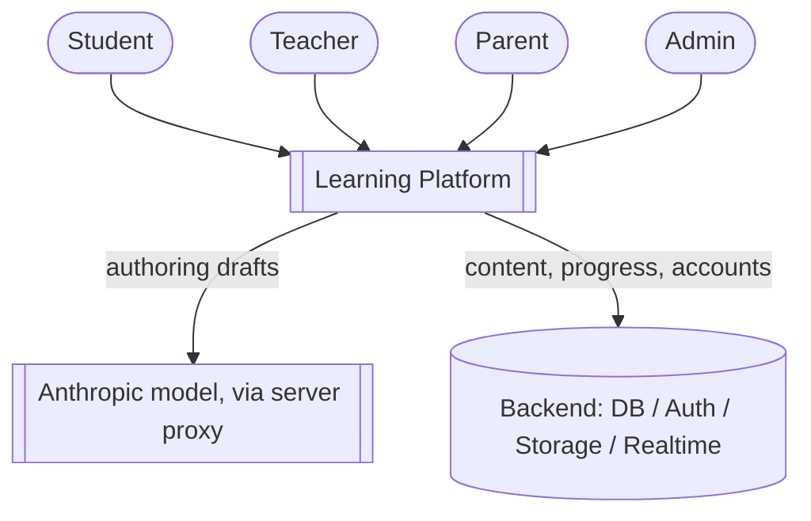

# Functional Architecture

What the platform does, and for whom. Grounded in the current app and the
[platform vision](../README.md); the data behind it is in [`data-model.md`](data-model.md).

## Actors & their jobs

| Actor | Primary jobs |
|---|---|
| **Student** | Learn (lessons, exercises, recap); self-assess (quizzes, term tests, labs); compete (duels, leaderboards, competitions); track own progress. |
| **Teacher** | Author content (Design Studio + AI); create/manage classes; assign content; monitor student progress; run teacher-assisted lessons. |
| **Parent / Guardian** | Read-only view of *their own child's* progress; receive nudges/reports. |
| **Admin** | Manage users & orgs; moderate/approve shared content (esp. published assets); map the syllabus; run competitions; platform configuration. |

## System context

## Core loops

The platform is four repeating loops over shared content:

1. **Learn** — a student opens a **lesson** section, reads and interacts with its blocks;
   progress is recorded per section.
2. **Assess** — **exercises, quizzes, term tests, and labs** produce graded **attempts**
   that feed mastery and drive revision suggestions.
3. **Author** — a **teacher (with AI assistance)** turns a chapter into content in the
   **Design Studio**, reviews it, and **publishes** a version students can see.
4. **Compete** (the gamified/social layer) — **duels, leaderboards, points/streaks, and
   monthly competitions** turn assessment into a social, motivating experience.

## Content taxonomy — one primitive, many types

Everything a teacher creates is **a section of blocks** ([ADR-0001](adr/0001-content-as-data-driven-blocks.md)).
Only the allowed block palette changes per type:

| Content type | Made of | Status |
|---|---|---|
| **Lesson** | presentational + explore blocks (prose, callout, cardGrid, figure, revealTabs, stepper) | ✅ built |
| **Exercise** (N per chapter, teacher's discretion) | assessment blocks (orderTimeline, sortBins, mcq) | ✅ blocks built |
| **Recap** | a short revision note — termList + prose + callout | ✅ blocks built |
| **Assessment** (MCQ / structured quiz) | mcq, sortBins | ✅ blocks built |
| **Lab** (Science / Language — new) | a `simulation` / lab block tier (interactive, slider/audio-driven) | 🔜 new blocks |

## Content dimensions

Content is addressed along four axes:

- **Grade** 1–13
- **Subject** — science / math / language / general (block-catalog domains)
- **Medium** — Sinhala / Tamil / English ([ADR-0005](adr/0005-i18n-medium-as-dimension.md) — a first-class dimension)
- **Syllabus / learning path** — the local-syllabus ordering of chapters

## Two modes of learning

- **Self-learning** — student-driven, self-paced. (What the app does today.)
- **Teacher-assisted** — a teacher assigns content to a **class**, guides it, and monitors
  progress; parents get read-only visibility into their child.

## Capability map

| Area | Capabilities |
|---|---|
| **Discovery** | Browse chapters by grade/subject/medium; search; resume in progress. |
| **Learning** | Render block content; interactive exercises; recap notes. |
| **Assessment** | In-chapter exercises; Quiz Arena (module quiz, time attack, term test); labs. |
| **Authoring** | Design Studio (block editor + live preview); AI-draft (paste/PDF → review); asset library. |
| **Social** | Duels, leaderboards, competitions, points/streaks. |
| **Management** | Classes, enrollment, assignments, parent links; moderation; admin config. |
| **Cross-cutting** | Accounts & roles; i18n (3 media); progress & mastery; offline reads. |

## You are here (2026-07)

- **Built:** the block content model + renderer; a live block catalog; 9 chapters (2 fully
  data-driven); the visual/figure tier; Quiz Arena; the **Design Studio** (lesson editor)
  with a **live preview** and the **AI-draft** path (paste/PDF → validate → review).
- **Client-only, single dimension:** Grade 9 · Science · English; progress in
  `localStorage`; no accounts, roles, classes, or social layer yet.
- **Next by function:** accounts + progress in a real backend, then content dimensions +
  i18n, then teacher-assisted mode and the social layer. Order is in [`roadmap.md`](roadmap.md).
