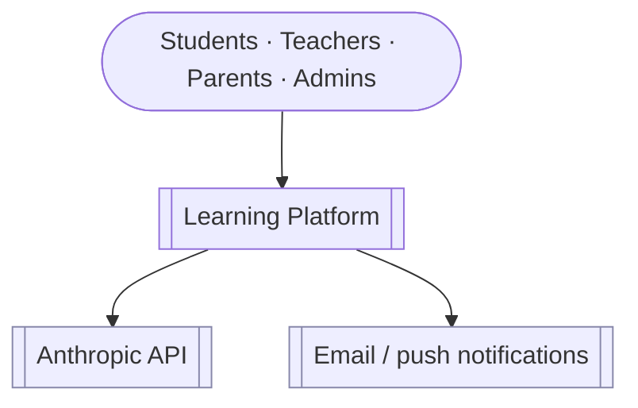
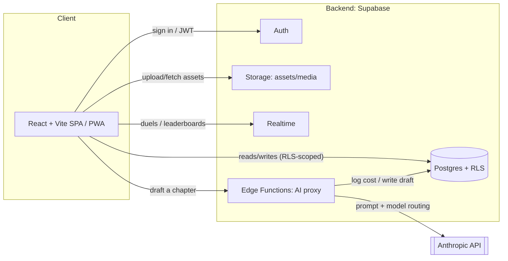

# Technical Architecture

How the platform is built. This is the **C4 top two levels** (Context, Container) plus the
cross-cutting concerns; below container level the code is the source of truth. Decisions
are recorded in [`adr/`](adr/); the schema is in [`data-model.md`](data-model.md).

## Level 1 — System context

The platform is a web app backed by a managed backend; it calls the Anthropic model
**only through its own server proxy** ([ADR-0006](adr/0006-ai-authoring-via-server-proxy.md)),
never directly from the browser.

## Level 2 — Containers

Recommended stack ([ADR-0002](adr/0002-backend-platform-supabase.md)): keep the **React +
Vite SPA** (add a service worker for PWA/offline) and use **Supabase** for Auth, Postgres +
RLS, Storage, Realtime, and Edge Functions (which host the AI proxy). Revisit an SSR
framework (Next.js) only if SEO/SSR later demands it.

## Key data flows

| Flow | Path |
|---|---|
| **Sign in** | SPA → Auth → JWT; the JWT scopes every subsequent DB read/write via RLS. |
| **Learn / render** | SPA reads the published `content_version.content` (JSONB) → renders through `BlockRenderer` with **no transform** ([ADR-0003](adr/0003-content-storage-and-versioning.md)). |
| **Progress** | SPA writes `section_progress` (upward-only merge); offline writes queue and sync on reconnect. |
| **Author (AI draft)** | SPA sends chapter text/PDF-text + options → Edge Function builds the prompt, routes to model(s), validates the `ContentSection` JSON, returns it → SPA loads it into the Design Studio for review → publish writes a new `content_version`. |
| **Compete** | Duels/leaderboards use Realtime subscriptions over `duel` / `leaderboard_entry`. |

## The AI authoring pipeline (target)

Today: prompt + validation live client-side (`src/ai/*`); the direct API call is a dev-only
path. Target: the same logic runs in the Edge Function proxy, which adds —

- **Per-phase model routing** — cheap model (Sonnet/Haiku) for outline & draft, Opus for
  assessment answer keys and diagram SVGs (the `PHASE_MODEL_DEFAULTS` seam in
  `src/ai/models.ts`).
- **Prompt caching** — the ~13K-token static catalog/schema/example is identical per
  chapter → cache once, read near-free thereafter.
- **Validation as the authoritative gate** — `draftValidation.ts` runs server-side before
  anything can be stored or shown.
- **Cost/audit logging** — `ai_generation` rows (model, phase, tokens, cost).

Rough cost (Opus 4.8): ~$0.60 for a single draft, ~$1.00–1.50 for a full phased pipeline
per chapter; output tokens dominate, so model tiering + caching are the main levers.

## Cross-cutting concerns

| Concern | Approach |
|---|---|
| **Auth / access** | Supabase Auth + Postgres RLS on every table ([ADR-0004](adr/0004-auth-roles-and-multitenancy.md)) — the DB is the security boundary. |
| **i18n** | Content is per-medium ([ADR-0005](adr/0005-i18n-medium-as-dimension.md)); UI-chrome strings use a conventional string catalog. |
| **Offline / connectivity** | PWA: cache published content for offline reading; queue `section_progress` writes and sync on reconnect (important for SL connectivity). |
| **Performance** | Published content is cache-friendly (versioned, immutable) → CDN; the SPA is code-split (e.g. PDF.js loads lazily). |
| **Security** | No client keys ([ADR-0006](adr/0006-ai-authoring-via-server-proxy.md)); inline SVG is sanitized (`sanitizeSvg.ts`); RLS + input validation. |
| **Accessibility** | ARIA roles/labels, keyboard operation, `prefers-reduced-motion` — already practiced in the block components; keep it a definition-of-done. |
| **Cost control (AI)** | Model tiering, prompt caching, and batching; per-generation logging. |
| **Observability** | (Target) request logs on the proxy; error tracking; usage/cost dashboards. |

## Current vs target

- **Current:** client-only React + Vite SPA; all data in TypeScript modules + `localStorage`;
  AI via an optional dev-only browser call.
- **Target:** the same SPA (as a PWA) over Supabase; content/progress/accounts in Postgres
  under RLS; AI via the Edge Function proxy. The migration path is table-by-table in
  [`data-model.md`](data-model.md) and staged in [`roadmap.md`](roadmap.md).
